# Run PHP project

This project was created using PHP **7.4.27** version.

The entire project was built according to the best practices of PSR recommendations, such as 1 and 4, for example.

Git project repository: https://github.com/satellasoft/test-api

This project does not use database, like mysql or sqlite for example. Here we use a .json file that is stored in the **data/account.json** folder.

To execute this project, running PHP Server, like a:

```bash
php -S localhost:8000
```

When server is running, then put address bellow into browser:

**http://localhost:8000**


You need execute composer command to generate all autoload file, like a PSR-4 and FILES and dependencies.

```bash
composer update
```

## Composer commands

If you want, you can start server with:

```bash
composer serve
```

To execute test, just enter (running in http://localhost:8000):

```bash
composer test
```

# Test

This project was hosted in http://teste.gunnarcorrea.com.

Locally in http://localhost:8000.

All test in [**IPKISS**](https://ipkiss.pragmazero.com) pass: 


[Clique aqui para ver o resultado.](https://ipkiss.pragmazero.com/test?url=http%3A%2F%2Fteste.gunnarcorrea.com&script=--%0D%0A%23+Reset+state+before+starting+tests%0D%0A%0D%0APOST+%2Freset%0D%0A%0D%0A200+OK%0D%0A%0D%0A%0D%0A--%0D%0A%23+Get+balance+for+non-existing+account%0D%0A%0D%0AGET+%2Fbalance%3Faccount_id%3D1234%0D%0A%0D%0A404+0%0D%0A%0D%0A%0D%0A--%0D%0A%23+Create+account+with+initial+balance%0D%0A%0D%0APOST+%2Fevent+%7B"type"%3A"deposit"%2C+"destination"%3A"100"%2C+"amount"%3A10%7D%0D%0A%0D%0A201+%7B"destination"%3A+%7B"id"%3A"100"%2C+"balance"%3A10%7D%7D%0D%0A%0D%0A%0D%0A--%0D%0A%23+Deposit+into+existing+account%0D%0A%0D%0APOST+%2Fevent+%7B"type"%3A"deposit"%2C+"destination"%3A"100"%2C+"amount"%3A10%7D%0D%0A%0D%0A201+%7B"destination"%3A+%7B"id"%3A"100"%2C+"balance"%3A20%7D%7D%0D%0A%0D%0A%0D%0A--%0D%0A%23+Get+balance+for+existing+account%0D%0A%0D%0AGET+%2Fbalance%3Faccount_id%3D100%0D%0A%0D%0A200+20%0D%0A%0D%0A--%0D%0A%23+Withdraw+from+non-existing+account%0D%0A%0D%0APOST+%2Fevent+%7B"type"%3A"withdraw"%2C+"origin"%3A"200"%2C+"amount"%3A10%7D%0D%0A%0D%0A404+0%0D%0A%0D%0A--%0D%0A%23+Withdraw+from+existing+account%0D%0A%0D%0APOST+%2Fevent+%7B"type"%3A"withdraw"%2C+"origin"%3A"100"%2C+"amount"%3A5%7D%0D%0A%0D%0A201+%7B"origin"%3A+%7B"id"%3A"100"%2C+"balance"%3A15%7D%7D%0D%0A%0D%0A--%0D%0A%23+Transfer+from+existing+account%0D%0A%0D%0APOST+%2Fevent+%7B"type"%3A"transfer"%2C+"origin"%3A"100"%2C+"amount"%3A15%2C+"destination"%3A"300"%7D%0D%0A%0D%0A201+%7B"origin"%3A+%7B"id"%3A"100"%2C+"balance"%3A0%7D%2C+"destination"%3A+%7B"id"%3A"300"%2C+"balance"%3A15%7D%7D%0D%0A%0D%0A--%0D%0A%23+Transfer+from+non-existing+account%0D%0A%0D%0APOST+%2Fevent+%7B"type"%3A"transfer"%2C+"origin"%3A"200"%2C+"amount"%3A15%2C+"destination"%3A"300"%7D%0D%0A%0D%0A404+0%0D%0A%0D%0A)

# Flow

```mermaid
  flowchart LR

  A[Composer] --> B(Inicia servidor)
  B --> C(API disponível)
```



# Router

If you need add more routes, just edit file **app/Router.php**.

You have two methods from Router instance class, ```->post()``` and ```->get()```. The first parameter is endpoint, the second is a array with two positions:

* position 1: Full path to controllas;
* position 2: Method to execute.

```php
$router->post('reset', [\App\Classes\Reset::class, 'reset']);
```

# Config

In Config file **app\Config.php**, you can change host adress and json save path.

# Input

The input class has storage in **app\Helpers\Input.php**. It provides three statics methods:

* ```::post()``` - To receive post data;
* ```::get()```  - To receive get data from query string;
* ```::getRaw()``` - To receive raw data;